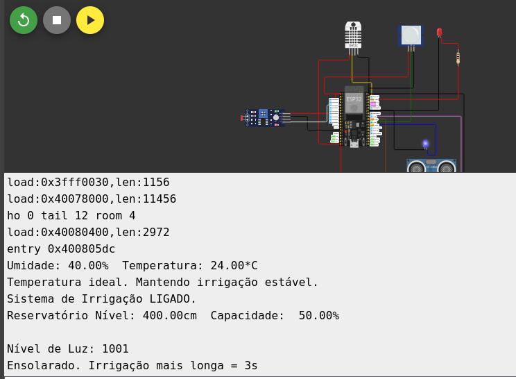
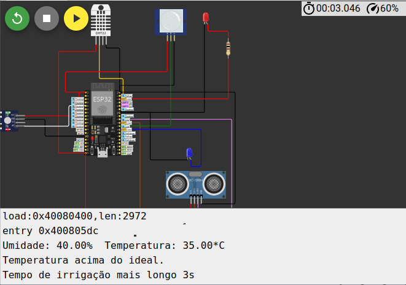
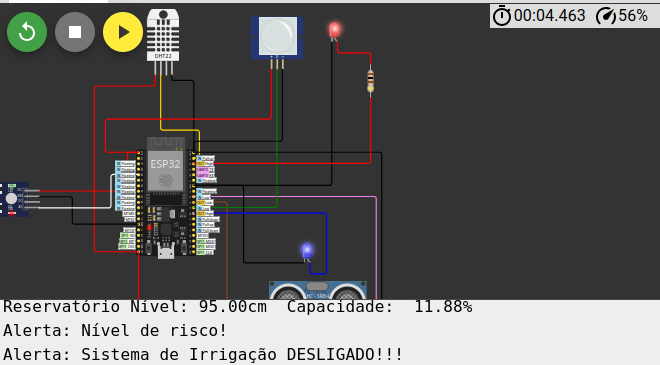
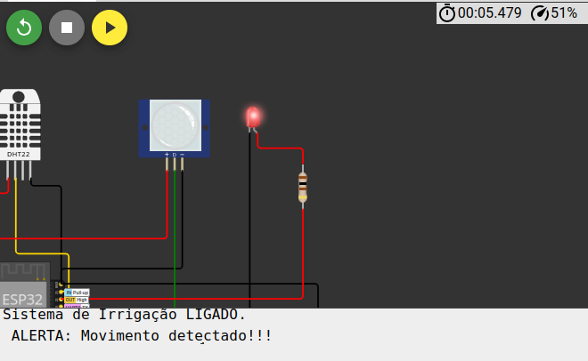
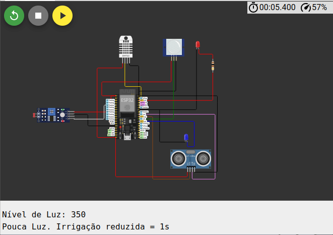

## Projeto de Monitoramento Ambiental para Agricultura

### Objetivo
Desenvolvimento de um sistema para monitorar e controlar o ambiente em aplicações agrícolas, otimizando a irrigação e a segurança da propriedade. O sistema utiliza sensores para coletar dados sobre temperatura, umidade, nível de água, luminosidade e movimento, permitindo a tomada de decisões automatizadas e a geração de alertas.

### Sensores
* **DHT22:** Mede temperatura e umidade relativa do ar, enviando alertas ou tomando ações automáticas para aumentar ou diminuir a irrigação dependendo das condições.
* **HC-SR04:** Verifica o nível de água nos tanques e aciona a irrigação apenas quando o nível está adequado, evitando desperdício de água.
* **PIR:** Detecta invasões de animais ou pessoas em áreas restritas da fazenda, ativando alarmes ou sistemas de segurança.
* **LDR:** Mede a quantidade de luz solar recebida e ajusta a irrigação automaticamente, diminuindo a quantidade de água em dias nublados e aumentando em dias mais ensolarados.

### Configuração e Execução no Wokwi e ESP32
**Wokwi:**
1. **Crie um novo projeto:** Acesse a plataforma Wokwi.
2. **Adicione componentes:** Arraste os componentes para a área de trabalho.
3. **Conecte componentes:** Conecte os pinos de acordo com o diagrama esquemático.
4. **Cole o código:** Copie e cole o código do seu projeto.
5. **Simule:** Clique em "Simular" para executar e visualizar os resultados.

### Instruções de Instalação e Dependências
**Bibliotecas:**
* **DHT:** Para leitura de dados de sensores de temperatura e umidade da família DHT.

**Software:**
* **Wokwi:** Simulador online para prototipagem rápida.
site: https://wokwi.com/

* **Diagrama esquemático:** 

**Testes Realizados**
Teste 01 - geral

Teste 02 - Informando temperatura 35°C

Teste 03 -  Informando nivel reservatório 95 cm ( Led Azul deve acender)

Teste 04 - sensor PIR detectando movimento ( LED vermelho deve acender )

Teste 05 - Infomando Nivel de luz 350

